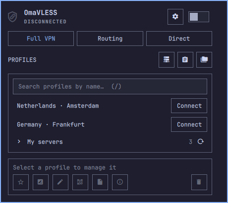

# OmaVLESS

OmaVLESS is a VPN app for Omarchy that puts everyday connection controls
directly in the bar.

Bring your own compatible VLESS profile or HTTPS subscription, choose
**Full VPN**, **Routing** or **Direct**, and connect from the panel. Switch
between profiles or disconnect without leaving the desktop; one VPN connection
is active at a time.

Expand subscriptions and refresh their server lists beside your profiles.
Profile management, routing tools, English/Russian language settings and
privacy-safe support reports stay close at hand in a compact, terminal-style
interface.

Free and open source. **OmaVLESS is not a VPN provider:** VPN servers, accounts
and service subscriptions are not included.

*Native interface with demonstration data; no live connection is shown.*

## Installation

**0.8.2 is a release candidate.** See the [prerelease](https://github.com/k-kostin/omavless/releases/tag/v0.8.2)
for the matching application packages and frontend. Do not pair this frontend
with older 0.8.0/0.8.1 packages. Fresh guided installation has been checked on
Omarchy x86_64; stable promotion and the marketplace update are still pending.

Follow the [installation and upgrade guide](docs/user/NATIVE_INSTALL.md),
including migration instructions if you already use the marketplace version.
It covers the matching application package, Mihomo VPN core, TUN permissions
and optional clipboard, file-picker and QR tools. Package installation and
permission changes require your confirmation.

## Everyday use

1. Import a profile link or subscription URL from the clipboard or a file.
   Review the preview before saving.
2. Choose **Full VPN**, **Routing** or **Direct**.
3. Press **Connect** beside the profile you want. Selecting a profile for
   management is not the same as connecting it.

On the native main screen, expand a subscription to browse its profiles. Press
**↻** beside the subscription's server count to download its updated server
list. Profile management stays in the separate action bar below the list.

- **Full VPN** sends traffic through the connected profile.
- **Routing** uses the selected country policy and your domain/IP rules.
- **Direct** keeps the TUN running while bypassing the proxy.

Settings contains language selection, routing tools, diagnostics, subscription
management and shutdown controls. Changing the UI language does not restart
the VPN. Automatic connection at login is Off by default; see the usage guide
for its current limitations.

See [controls and everyday use](docs/user/NATIVE_USAGE.md).

[View the expanded subscription](docs/marketing/images/subscription-en.png)
· [View Settings](docs/marketing/images/settings-en.png)

## Supported inputs

| Family | Status |
| --- | --- |
| VLESS | Supported; includes TCP, WebSocket, HTTP, H2, gRPC and XHTTP, with TLS/REALITY where compatible |
| Trojan, Hysteria2, TUIC v5 | Experimental; real-server coverage is incomplete |
| Subscriptions | HTTPS raw/base64 lists of supported profile links |

Advanced VLESS Encryption/REALITY PQ and XHTTP combinations retain their
experimental limitations. WireGuard, AmneziaWG and `vpn://` inputs are not
currently supported by the application.

See [protocol support and limitations](docs/user/PROTOCOLS.md).

## Privacy and help

Profiles and subscription URLs stay in a private local store. Imports accept
supported profile links, not arbitrary remote configuration or executable content.

For support, use **Copy report** or **Save report** in Settings. Do not post
profile files, subscription URLs, private configuration or unredacted screenshots.

- [Troubleshooting](docs/user/TROUBLESHOOTING.md)
- [Security and privacy](docs/user/SECURITY.md)
- [Native updates, Quit and removal](docs/user/NATIVE_INSTALL.md#updates-close-quit-and-removal)
- [Release notes](CHANGELOG.md)

## Credits and license

Maintained by [kdk](https://github.com/k-kostin). Community project; not
affiliated with Omarchy, MetaCubeX or a VPN provider.

The interface builds on [Omarchy VPN](https://github.com/jkoestinger/omarchy-vpn)
by Justin Köstinger. Routing data comes from RoscomVPN, MetaCubeX and
Chocolate4U. See [third-party notices](THIRD_PARTY_NOTICES.md).

[MIT License](LICENSE) · [Contributing](docs/README.md#developing-and-reviewing).
